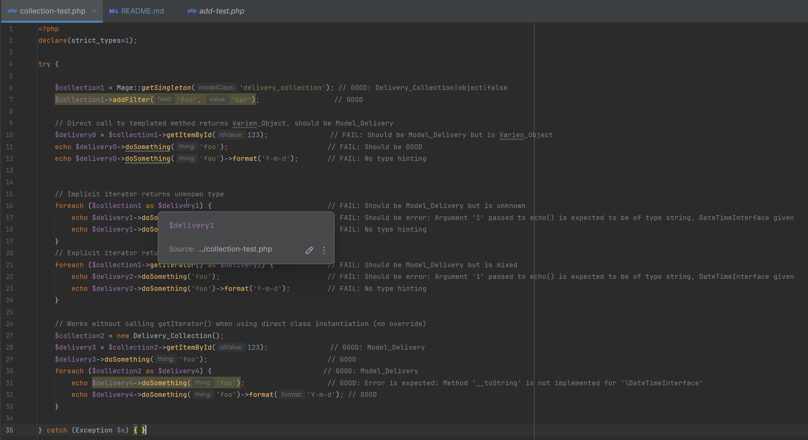

It seems that PhpStorm generic support does not work in combination with `.phpstorm.meta.php` overrides.

The tests in [collection-test.php](collection-test.php) all pass in the VS Code extensions:
- PHP by DEVSENSE
- PHP Intelephense by Ben Mewburn

Latest version tested: Build #PS-252.23892.419, built on August 1, 2025
Related issues:

- https://youtrack.jetbrains.com/issue/WI-66293/Meta-override-map-function-messes-up-with-defined-return-type-and-covariant-return
- https://youtrack.jetbrains.com/issue/WI-70865/Generics-stop-working-on-using-method-chaining-or-a-class-property
- https://youtrack.jetbrains.com/issue/WI-60782/Advanced-metadata-doesnt-work-in-case-the-class-is-returned-via-a-method

